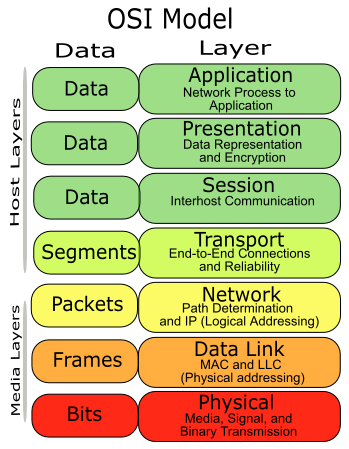

# 7 OSI Layer

NAMA    : NUFUS AKMALUL MAFAZA

KELAS   : 2 D4 IT A

NRP     : 3122600026

    

Model OSI (Open System Interconnection) diciptakan oleh International Organization for Standardization (ISO) yang menyediakan kerangka logika terstruktur bagaimana proses komunikasi data berinteraksi melalui jaringan. Dahulu komunikasi data yang melibatkan komputer-komputer dari vendor yang berbeda-beda. Masing-masing vendor menggunakan protocol dan format data yang berbeda-beda. Sehingga ISO membuat suatu arsitektur komunikasi yang dikenal sebagai model OSI yang mendefinisikan standar untuk menghubungkan komputer-komputer dari vendor yang berbeda

Secara umum, fung    si dan penjelasan masing-masing layer adalah sebagai berikut :

<ul>
    <li>
        Physical Layer
        

            Untuk mendefinisikan media transmisi jaringan, sinkronisasi bit, arsitektur jaringan (seperti Ethernet), topologi jaringan dan pengabelan. Selain itu, level ini juga mendefinisikan bagaimana Network Interface Card (NIC) dapat berinteraksi dengan media kabel atau radio. Data biner dikodekan dalam bentuk yang dapat ditransmisi melalui media jaringan, sebagai contoh kabel, transceiver dan konektor yang berkaitan dengan layer Physical. Peralatan seperti repeater, hub dan network card berada pada layer ini
        

    </li>
    <li>
        Data-link layer
        

            Fungsi utama dari data link layer adalah untuk memeriksa bila terjadi kesalahan dalam menyalurkan transmisi terhadap bit data. Dimana kesalahan tersebut kemungkinan besar terjadi di layer pertama. Pada layer ini juga terjadi koreksi kesalahan, pengalamatan hardware pada MAC address, dan flow control.
        

    </li>
    <li>
        Network Layer
        

            Untuk mendefinisikan alamat-alamat IP dan menyediakan fungsi routing sehingga paket dapat dikirim keluar dari segment network lokal ke suatu tujuan yang berada pada suatu network lain. Contoh protocol yang digunakan seperti IP
        

    </li>
    <li>
        Transport Layer
        

            Untuk memecah data ke dalam paket-paket data serta memberikan nomor urut ke paket-paket tersebut sehingga dapat disusun kembali pada sisi tujuan setelah diterima. Selain itu, pada level ini juga membuat sebuah tanda bahwa paket diterima dengan sukses (acknowledgement), dan mentransmisikan ulang terhadap paket-paket yang hilang di tengah jalan.
        

    </li>
    <li>
        Session Layer
        

            Untuk mendefinisikan bagaimana koneksi dapat dimulai, dipelihara, atau diakhiri. Beberapa protocol pada layer ini: NETBIOS: suatu session interface dan protocol, dikembangkan oleh IBM, yang menyediakan layanan ke layer presentation dan layer application. NETBEUI, (NETBIOS Extended User Interface), suatu pengembangan dari NETBIOS yang digunakan pada produk Microsoft networking, seperti Windows NT dan LAN Manager. ADSP (AppleTalk Data Stream Protocol). PAP (Printer Access Protocol), yang terdapat pada printer Postscript untuk akses pada jaringan AppleTalk
        

    </li>
    <li>
        Presentation Layer
        

            Untuk mentranslasikan data yang hendak ditransmisikan oleh aplikasi ke dalam format yang dapat ditransmisikan melalui jaringan. Protokol yang berada dalam level ini adalah perangkat lunak redirektor (redirector software), seperti layanan Workstation (dalam Windows NT) dan juga Network shell (semacam Virtual Network Computing (VNC) atau Remote Desktop Protocol (RDP)).
        

    </li>
    <li>
        Aplication Layer
        

            Sebagai antarmuka dengan aplikasi dengan fungsionalitas jaringan, mengatur bagaimana aplikasi dapat mengakses jaringan, dan kemudian membuat pesan-pesan kesalahan. Protokol yang berada dalam lapisan ini adalah HTTP, FTP, SMTP, dan NFS.
        

    </li>
</ul>
