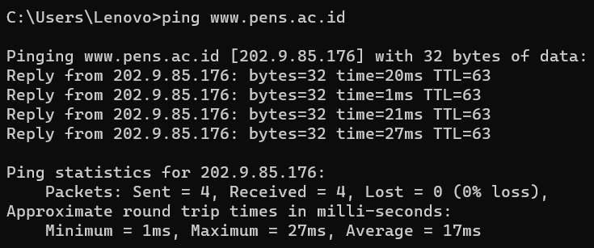
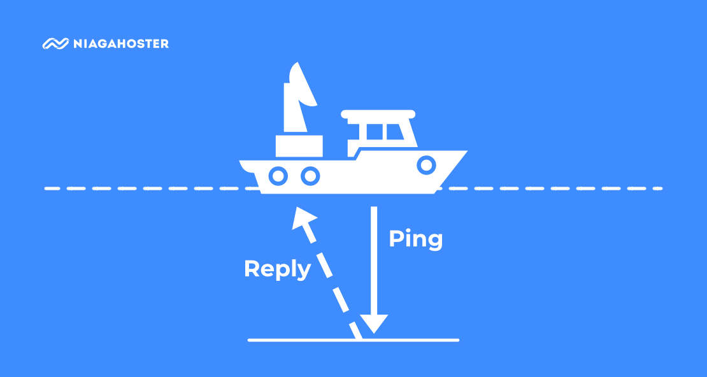
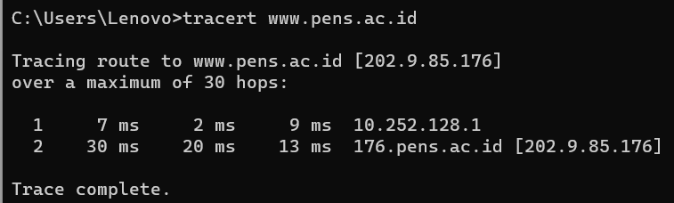

# Penjelasan tentang Ping dan Traceroute
## ping 

    

Ping merupakan singkatan dari Packet Internet Network Groper. Secara sederhana, ping adalah perintah untuk mengecek status dan keberadaan host dalam sebuah jaringan internet. Prinsip utama ping adalah seperti penggunaan sonar untuk mengukur kedalaman laut. Jadi, sebuah sinyal dikirimkan ke dasar, lalu lamanya waktu kembali ke atas menjadi dasar perhitungannya

    

## Traceroute

    

Tracroute adalah alat diagnostic jaringan yang digunakan untuk secara real time melacak jalur yang diambil oleh paket pada jaringan IP dari sumber ke tujuan. Juga melaporkan alamat IP dari semua router yang tersambung.Traceroute juga akan mencatata waktu yang dimbil dalam suatu lompatan atau hops yang terjadi selama proses routing ke tujuan.Inilah pengertian traceroute.

### cara kerja traceroute : 
Saat Anda memasukkan perintah traceroute, utilitas akan memulai pengiriman paket menggunakan Internet Control Message Protocol (ICMP), termasuk Time to Live (TTL) yang dirancang untuk dilampaui oleh router pertama yang menerimanya. ICMP dan TTL ini akan mengembalikan pesan Time Exceed. Hal ini memungkinkan traceroute menentukan waktu yang diperlukan untuk ke hop router pertama. Meningkatkan time limit, mengirimkan ulang paket sehingga akan mencapai paket router kedua di jalur tujuan, yang mengembalikan pesan time exceeded lainnya, dan sebagainya.
Traceroute menentukan kapan paket telah mencapai tujuan dengan memasukkaan nomor port yang berada di luar jumlah normal. Ketika diterima, pesan “Port Unreachable akan dikembalikan". Ini memungkinkan traceroute untuk mengukur panjang waktu hop terakhir.