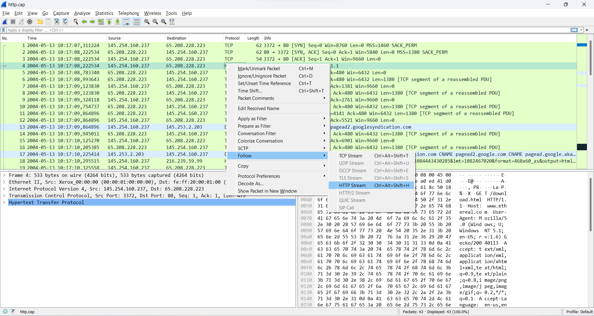
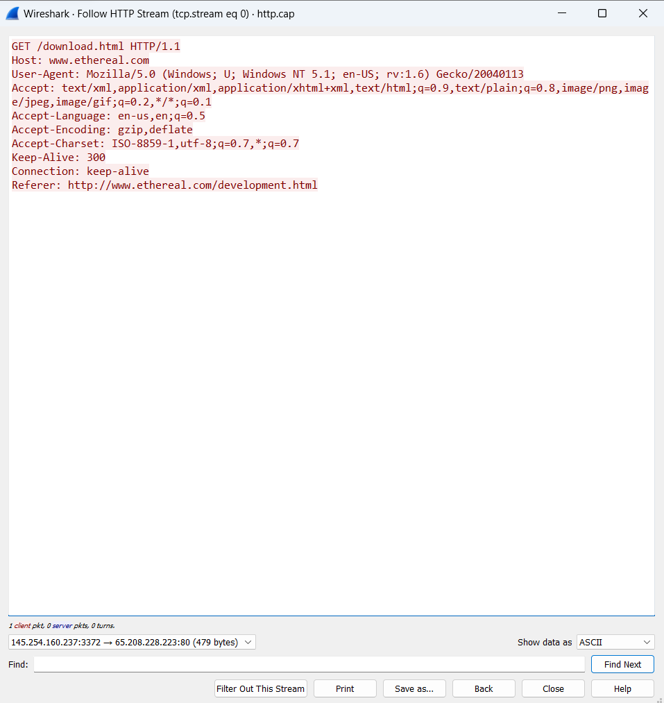
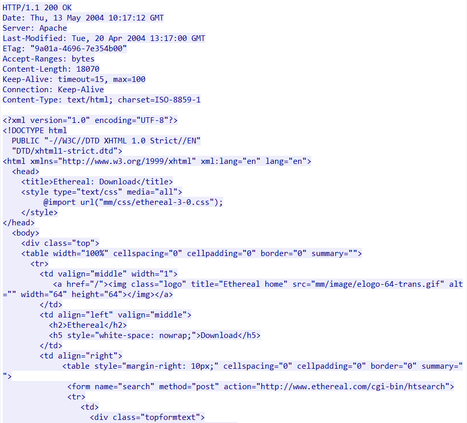
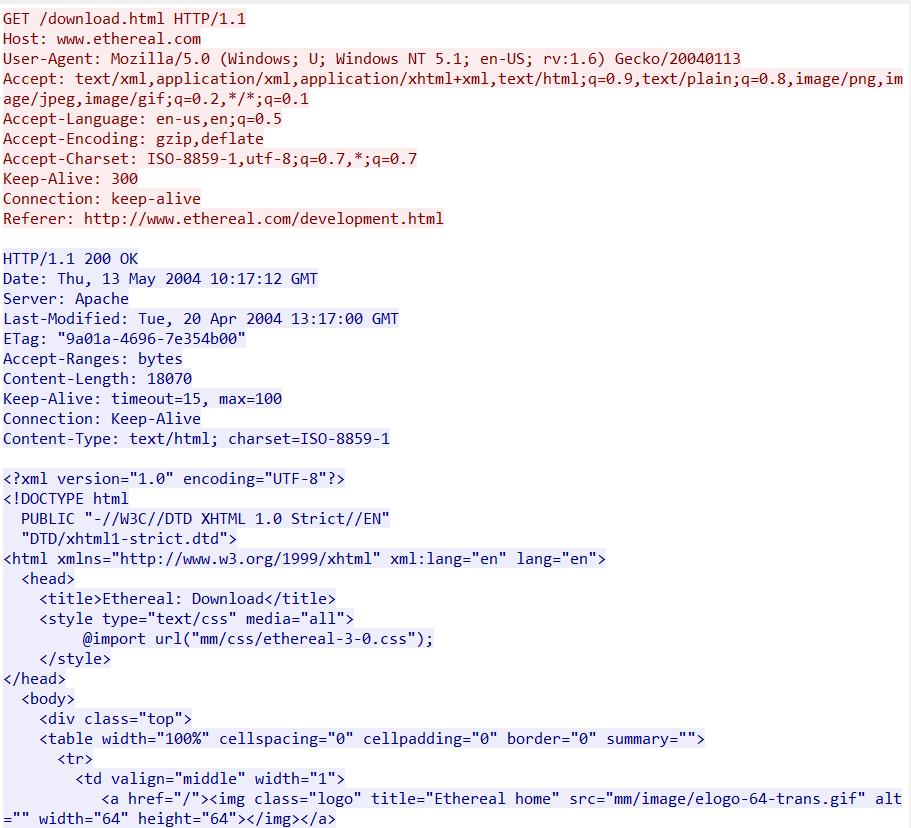
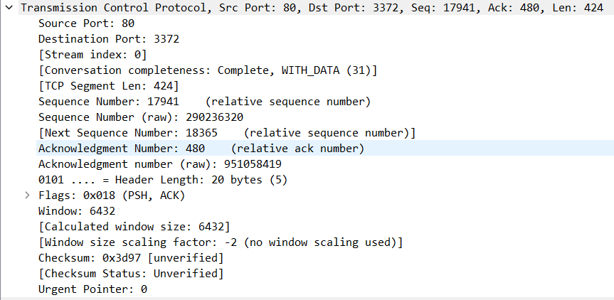
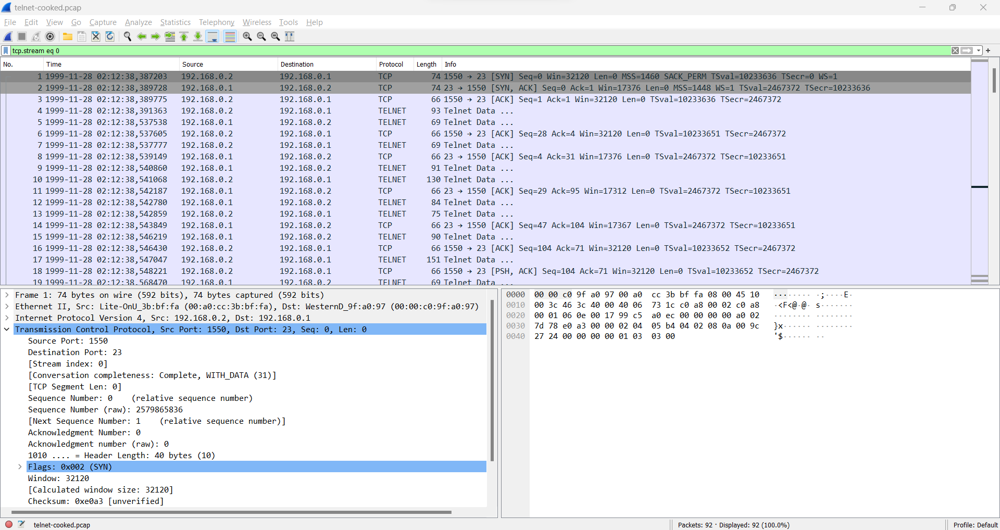
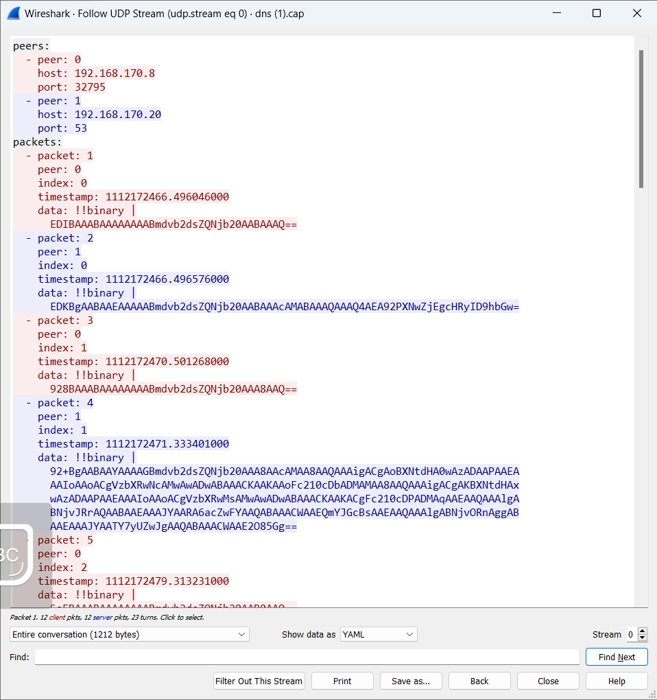

# Praktikum Wireshark

pada percobaamn kali ini kita menggunakan sample http.cap yang sudah kita download.

    

Untuk memeriksa semua data yang mengalir dalam sesi HTTP (Protokol Transfer HyperText) yang telah direkam dalam paket jaringan, Anda dapat memanfaatkan fitur "Follow HTTP Stream." Ini membantu dalam melihat keseluruhan permintaan dan tanggapan HTTP dalam format yang lebih mudah dibaca

    

warna merah merupakan sebuah "request" yang mana mencakup permintaan yang dikirimkan oleh klien keserver. Anda akan melihat detail seperti metode (GET, POST, dll.), URI, dan header permintaan.

    

sedangkan warna biru merupakan sebuah respon dari server ke klien, yang mana akan menampilkan kode status HTTP, header respons, dan body data.

    

jika kedua warba digabung maka akan menjadi 

    

Lalu kita juga dapat melihat berbagai informasi dari source yang kita inginkan. Semisalnya kita dapat melihat Source Port, dan Destination Portnya

    

Sekarang mari ubah sample menjadi telnet-cooked.pcap

    

Saat kita menggunakan Stream dari Telnet, kita dapat melihat bahwa request dan responsenya berbeda dari HTML, dari sini kita melihat bahwa request dan responsenya bertipe TCP yang berupa ThreeWay-Handshake.

    

mari kita ubah lagi sample menjadi dns.cap dan lihat UDP Stream

    

Ada beberapa hal yang bisa kita amati di dns.cap:
- Domain yang di-query.
- Tipe query yang di-request.
- IP Address yang dikembalikan oleh respons.
- Kesalahan apa pun yang terjadi selama sesi query DNS.