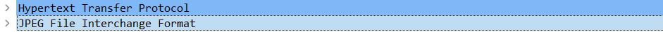

# Analisis HTTP CTF image in pocket

Dengan menggunakan Wireshark kita dapat mengehatui traffic internet dan data packet yang didistribusikan. Berikut merupakan cara mencari packet jpeg pada traffic di Wireshark
- cari data yang mengandung jpeg

    

- cari format jpeg

    

klik kanan dan show packet maka foto akan terlihat

- hasil foto

    

