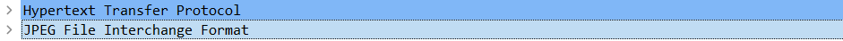

# TCP in HTTP

    

*sample http.cap* 

Dari 43 packet diatas, klik kanan>follow>tcp stream pada salah satu packet dengan protocol HTTP untuk memfilter packet yang berhubungan dengan HTTP.

    

*filtered pocked*

Wireshark akan secara otomatis memberi filter untuk menampilkan packet, sehingga terisa 34 packet dari 43.

# Flow Graph
- masuk ke statistics -> flow graph
- checklist limit to display filter 
- pada flow type pilih TCP Flow

    

FLow Graph Window berfungsi untuk menampilkan koneksi yang terjadi diantara kedua host(client/server). Disini ditampilkan berbagai informasi seperti packet time, arah koneksi, serta proses mulai dari connection establishment, data transfer hingga connection termination.

1. Connection Establishment

    

Tahap ini terjadi pada tiga packet awal. Berikut adalah rincian pada proses ini:
- pada detik 0.000000 clien engirim segment SYN(Synchronize Sequence Number) kepada server dengan sequence number 0.
- Pada detik 0.9113, server merespon kepada client berupa segment SYN-ACK dengan sequence number 0 serta acknowledgment numbr 1 yang berarti menyetujui koneksi dari client serta memberi sinyal pada client untuk mengirim segment selanjutnya dengan seq number 1.
- Pada detik 0.9113, client merespon server berupa persetujuan(ACK) dengan seq number 1 sesuai sinyal dari server.

Setelah 3 tahap tersebut, koneksi client-server sudah terjalin.

2. Data Transfer

    

Berikut adalah rincian dari proses transfer data:
- Pada detik 0.9113, client mengirim segment dengan panjang 479 bits serta membawa flag PSH yang berarti menginformasikan kepada penerima(server) untuk mengirimkan data kepada client. Selain itu, client juga mengirimkan ACK dengan value 1 yang menginformasikan kepada server untuk mengirimkan segment dengan seq number 1.
- Pada detik 1.4721, server mengirim 2 segment client dengan seq number 1. Segment ini berisi data sepanjang 1380 bits. Server juga mengirim ACK dengan value 480, yang berarti client akan mengirim dengan seq number 480 pada segment selanjutnya. Hal ini dikarenakan sebelumnya client telah mengirim segment dengan panjang 479 bits.

3. Connection Termination

    

- pada detik ke 17.905747 server mengirimkan flag FIN dengan seq 18365 dan ACK 480 berarti server memulai proses terminasi dan mengharapkan segmen selanjutnya akan dikirim dengan seq 480
- Pada detik 17.9057, client merespon berupa acknowledgment dengan tujuan menginformasikan kepada server jika FIN sudah diterima. Selanjutnya, FIN juga akan dikirimkan oleh client.
- Pada detik 30.0632, client juga mengirimkan FIN dengan seq 480 sesuai ack dari server serta menginformasikan pada server jika client juga melakukan terminasi koneksi.
- Pada detik 30.3937, server merespon berupa acknowledgment dengan tujuan menginformasikan kepada client jika FIN sudah diterima.

# Packed Counter

    

*Pocket Counter*

Kita bisa melihat statistik dari file http.cap dengan mengklik Statistics -> HTTP -> Packet Counter di toolbar. Berikut adalah informasi yang ada di dalam Packet Counter:
- Total Packets: Jumlah total paket HTTP yang ditangkap.
- Requests: Jumlah total request HTTP yang ditangkap.
- Responses: Jumlah total response HTTP yang ditangkap.
- Errors: Jumlah packet error HTTP yang ditangkap.
- Most Common Request Methods: Metode Request HTTP yang paling digunakan.
- Most Common Response Codes: Response Code yang paling banyak dikembalikan.

## Field di Pocked Counter
- Count : Field ini menunjukkan jumlah paket yang termasuk dalam rentang yang dipilih.
- Average : Field ini menunjukkan rata-rata panjang paket dalam rentang yang dipilih.
- Min val : Field ini menunjukkan panjang minimum dari paket apa pun dalam rentang yang dipilih.
- Max val : Field ini menunjukkan panjang maksimum dari paket apa pun dalam rentang yang dipilih.
- Rate (ms) : Field ini menunjukkan rata-rata paket per milidetik untuk paket dalam rentang yang dipilih.
- Percent : Field ini menunjukkan persentase paket dalam rentang yang dipilih, berdasarkan jumlah.
- Burst rate : Field ini menunjukkan jumlah maksimum paket dalam satu burst. Burst adalah serangkaian paket yang diterima dalam periode waktu singkat.

- Burst start : Field ini menunjukkan waktu saat paket pertama dalam burst diterima.

# Thoughput
Throughput adalah rata-rata jumlah data yang dapat ditransfer dari satu titik ke titik lain dalam sistem dalam periode waktu tertentu. Throughput diukur dalam satuan bit per detik (bps), kilobit per detik (kbps), megabit per detik (mbps), atau gigabit per detik (gbps).

    

Kita bisa mengakses Throughput dengan cara klik Statistics -> TCP Stream Graphs -> Throughput pada toolbar Wireshark.

# Analisis HTTP CTF image in pocket

Dengan menggunakan Wireshark kita dapat mengehatui traffic internet dan data packet yang didistribusikan. Berikut merupakan cara mencari packet jpeg pada traffic di Wireshark
- cari data yang mengandung jpeg

    

- cari format jpeg

    

klik kanan dan show packet maka foto akan terlihat

- hasil foto

    

